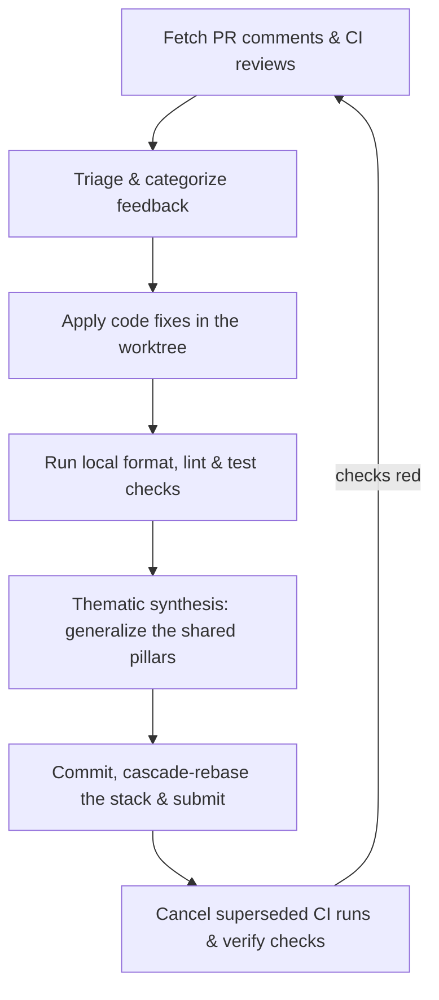

# Address PR Comments (Multi-Agent)

Autonomously address pull request review comments (human feedback and
automated review bots), apply and validate the fixes, synchronize stacked
PRs, and synthesize what CI caught into the shared review pillars so local
pre-merge review keeps getting stronger without growing an unbounded
checklist.

This skill runs in Muse, Claude Code, Codex, and Antigravity/Gemini. It
runs its `gh` and `git` commands directly and needs no subagents. It shares
the two tier review criteria with `agent-review-loop`: the stable base
pillars plus the evolving shared learnings file.

## 0. Core Invariants

1. **Zero AI attribution**: never attribute yourself or any AI assistant in
   commits, PR descriptions, code comments, docstrings, or prose.
2. **Punctuation**: never write an em dash (U+2014), and never use `--`
   or spaced hyphens as punctuation in prose. `--` stays allowed in
   command flags, code, and quoted output. In prose, use colons, commas,
   semicolons, parentheses, or separate sentences.
3. **Commit and push rules**:
   - Follow the repository's own commit convention (repo docs win over any
     default; never add attribution or trailer lines).
   - Stage only the files you changed, never a broad add in a tree you did
     not clean.
   - Confirm the push destination with the user before the first push,
     unless this session already approved pushes for this PR workflow.
4. **Verification gate**: everything must compile, the repo's own format and
   static-analysis gates must be clean, and the relevant tests must pass
   before the fix commit is pushed.

## Workflow



## Prerequisites

`gh` and `jq` must be on `PATH`. When they are installed but not found
(for example a macOS Homebrew install outside the inherited `PATH`),
prefix the commands below with
`export PATH="/opt/homebrew/bin:/usr/local/bin:$PATH"` (Apple Silicon,
then Intel Mac; Linuxbrew users add `$(brew --prefix)/bin` instead).

The skill takes a target PR number or URL. When omitted, use the open PR
for the current branch and stop when there is not exactly one. If the work
lives in a git worktree, run every `git` command against it explicitly
(`git -C <worktree> ...`) rather than relying on `cd`.

---

## 1. Fetch & triage PR comments

### A. Query the GitHub API for feedback

Retrieve both inline diff review comments and top-level issue and review
comments for the target PR `<pr_number>`:

```bash
# Inline diff comments
gh api /repos/{owner}/{repo}/pulls/<pr_number>/comments \
  | jq -r '.[] | "DIFF [\(.id)] \(.path):\(.line) by \(.user.login):\n\(.body)\n"'

# Top-level issue and review comments (Copilot, review bots, humans)
gh api /repos/{owner}/{repo}/issues/<pr_number>/comments \
  | jq -r '.[] | "ISSUE [\(.id)] by \(.user.login):\n\(.body)\n"'
```

### B. Categorize the findings

File every finding under one of the 8 Core Thematic Pillars (titles are
exact; the sibling `agent-review-loop` skill's base pillars file defines
them):

1. Low-Level Safety, Alignment & Buffer Invariants
2. Concurrency, Cancellation & State Machine Lifecycles
3. Error Propagation, Diagnostics & No-Panic Invariants
4. Multiplatform Portability & Cross-Binding Drift
5. Numerical Robustness & Boundary Validation
6. Pipeline Completeness & Contract Faithfulness
7. Performance, SIMD & Resource Efficiency
8. Code Simplification, Cleanup & Complexity Reduction

Read the base pillars from the sibling `agent-review-loop` skill directory
when it is installed alongside this one
(`../agent-review-loop/thematic-review-pillars.md`); otherwise triage
against the titles above plus every shared learnings file that exists (see
section 3).

Treat bot feedback as unverified until checked against the *current*
worktree code: a bot often flags logic that was already refactored or is
already handled. Document each false positive with its technical reasoning
plus the command and output that disproves it, so the next reader need not
re-derive the check, instead of changing code to silence it.

---

## 2. Apply fixes & validate locally

1. **Implement the fixes** with file editing tools in the worktree. Keep
   each fix minimal and behavior-scoped. Every fix ships with a test or
   reproduction run quoted as command plus result; prove each new
   regression test non-vacuous by showing it fails with the fix reverted.
   Before any fix that is large or structurally risky (broad refactor, API
   or signature change, control flow that could ripple), stop and ask the
   user before applying it.
2. **Generated-code synchronization** (only when a checked-in generated
   surface changed): regenerate every derived artifact the repo checks in
   (bindings, clients, docs) with the repo's own commands and confirm the
   regeneration leaves a zero git diff.
3. **Format, lint, and tests**: discover and run the repository's own
   gates; never substitute generic checks. Read the CI workflows and
   project docs first, then at minimum run the format gate, the linters
   for every affected language, and the full test files or packages
   covering the touched areas, unmodified. Mirror whatever gate set CI
   actually runs; a doc or lint step that only CI runs costs a wasted CI
   cycle and a force-push.

---

## 3. Thematic synthesis: generalize the shared pillars

**The goal**: make the next local review catch what CI caught, while
keeping the shared learnings clean, structured, and bounded. Never append
an open-ended list of specific micro-checks.

File after every fix cycle, not once at the end: when a push comes back
red and the workflow loops back through fixes, each cycle's lesson goes in
immediately. Later cycles in the same run read what earlier cycles filed,
so the same class of miss is caught locally the second time.

When CI catches something local review missed, file the lesson in the
shared refinements file both skills read. Resolution order for reading
(the more specific file wins a direct conflict):

- `$REVIEW_REFINEMENTS_FILE` when set (explicit override).
- Canonical `~/.agents/review-refinements.md` (default write target).
- Legacy `~/.gemini/review-refinements.md` (read only).
- Repo-local `.agents/review-refinements.md` (project specific).

Pick the write target in order:

1. `$REVIEW_REFINEMENTS_FILE` when set: write there.
2. A repo-specific lesson (it names this repo's modules, crates, tools, CI
   jobs, or architectures): file it in the repo's own
   `.agents/review-refinements.md`, creating that file with the 8
   `### Pillar N:` headings when it does not exist yet. Leave the
   repo-local file uncommitted; it goes out only with the user's approved
   commit.
3. Otherwise the canonical `~/.agents/review-refinements.md`. When it does
   not exist yet, create it with the 8 `### Pillar N:` headings, then
   append.
4. Never write the legacy `~/.gemini/review-refinements.md` path.

Re-read the target file immediately before editing, in the same step as
the write. Never edit from a stale copy; another loop may have filed
bullets since.

Rules:

1. **Subsumption first**: if an existing bullet under a pillar already
   covers the lesson, refine that bullet instead of adding a sibling.
2. **Generalize**: write the principle the finding taught (trigger,
   hazard, fix shape), not the instance. One bullet must help a future
   review in a different file.
3. **Higher-order abstraction**: when several specific checks are
   variations of one concept, synthesize them into a single principle
   rather than filing each one.
4. **File under the right pillar**: match the finding to one of the 8
   `### Pillar N:` sections. Never add a 9th pillar or rename one.
5. **Stay bounded**: at most 2 new or refined bullets per cycle, at most 5
   per run. Skip anything already covered, anything repo-specific trivia,
   and anything you are not confident will recur.
6. **Append-only discipline**: add or refine bullets only. Never delete or
   rewrite another loop's bullets, and never reformat the file.
7. **Tool-agnostic bullets**: state trigger, hazard, and fix shape. Never
   name an agent, model, runtime, or assistant tool in a bullet.
8. **No signatures**: no author, date, or source tags on bullets.

---

## 4. Commit, rebase the stack & manage CI

1. **Commit.** Conventional Commits, staged by name, and never add AI
   attribution, co-author, or session trailers:
   ```bash
   git add <files you changed>
   git commit -m "fix(<scope>): <what the review feedback asked for>"
   ```
   Update the branch devlog in the same commit when the repo keeps one.
2. **Push.**
   - Stacked PR workflow:
     ```bash
     gh stack rebase
     gh stack submit --auto
     ```
   - Plain branch: always push with an explicit destination refspec, never
     a bare `git push -u origin <branch>`, which can resolve to `main`
     through a stale upstream:
     ```bash
     git push -u origin HEAD:refs/heads/<type>/<branch-name>
     ```
3. **Cancel superseded CI runs.** Every push queues a build; cancel runs
   on this PR's branch whose head SHA is no longer the tip:
   ```bash
   branch=$(gh pr view <pr_number> --json headRefName --jq .headRefName) || { echo "ERROR: gh pr view failed; refusing to cancel"; exit 1; }
   tip=$(gh pr view <pr_number> --json headRefOid --jq .headRefOid) || { echo "ERROR: gh pr view failed; refusing to cancel"; exit 1; }
   [ -z "$tip" ] && { echo "no tip SHA; refusing to cancel"; exit 1; }
   for status in queued in_progress; do
     gh api --paginate "/repos/{owner}/{repo}/actions/runs?branch=$branch&status=$status" \
       --jq '.workflow_runs[] | "\(.id) \(.head_sha)"' \
     | while read -r id sha; do
         [ "$sha" = "$tip" ] || gh run cancel "$id"
       done
   done
   ```
   The guards matter: a failed lookup or an empty tip must never widen
   into cancelling other branches' runs.
4. **Resolve addressed review threads** via GraphQL, once the fix is
   pushed:
   ```bash
   gh api graphql -f query='
   mutation($threadId: ID!) {
     resolveReviewThread(input: {threadId: $threadId}) {
       thread { isResolved }
     }
   }' -F threadId="$THREAD_ID"
   ```
5. **Verify CI.**
   ```bash
   gh pr checks <pr_number>
   ```
   `gh pr checks --watch` **exits 0 even when checks fail**, so never
   trust its exit code. Read the status column, or:
   ```bash
   gh run list --branch <branch> --json conclusion,name,status
   ```
   If a check is red, first check whether `main` is red too before
   blaming the branch.

---

## 5. Output summary

Give the user a structured summary:

1. **Reviewed scope**: PR number plus the head SHA the comments were
   triaged against, so a mid-run push shows as drift.
2. **Addressed review items**: each comment handled, with file paths, line
   numbers, and what changed.
3. **False positives / dismissed feedback**: with the technical
   justification and disproving command for each.
4. **Shared pillars updated**: which pillar bullets in the shared
   refinements file were added or refined per cycle (with pillar numbers),
   and which redundant specific checks were folded in.
5. **Stack & CI status**: current commit SHA, stack sync state, and the
   real check results.
