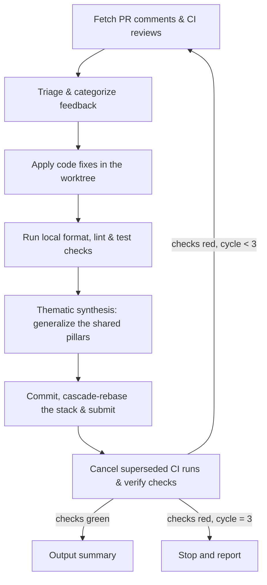

# Agent Review PR Comments (Multi-Agent)

Autonomously address pull request review comments (human feedback and
automated review bots), apply and validate the fixes, synchronize stacked
PRs, and synthesize what CI caught into the shared review pillars so local
pre-merge review keeps getting stronger without growing an unbounded
checklist.

This skill runs in Muse, Claude Code, Codex, and Antigravity/Gemini. It
runs its `gh` and `git` commands directly and needs no subagents. It shares
the two-tier review criteria with `agent-review-loop`: the stable base
pillars plus the evolving shared learnings file.

## 0. Core Invariants

1. **Zero AI attribution**: never attribute yourself or any AI assistant in
   commits, PR descriptions, code comments, docstrings, or prose.
2. **Punctuation**: never write an em dash (U+2014), and never use `--`
   or spaced hyphens as punctuation in prose. `--` stays allowed in
   command flags, code, and quoted output. In prose, use colons, commas,
   semicolons, parentheses, or separate sentences.
3. **Commit and push rules**:
   - Follow the repository's own commit convention (repo docs win over any
     default; never add attribution or trailer lines).
   - Stage only the files you changed, never a broad add in a tree you did
     not clean.
   - Confirm the push destination with the user before the first push,
     unless this session already approved pushes for this PR workflow.
4. **Verification gate**: everything must compile, the repo's own format and
   static-analysis gates must be clean, and the relevant tests must pass
   before the fix commit is pushed.

## Workflow



## Prerequisites

`gh` and `jq` must be on `PATH`. When they are installed but not found
(for example a macOS Homebrew install outside the inherited `PATH`),
prefix the commands below with
`export PATH="/opt/homebrew/bin:/usr/local/bin:$PATH"` (Apple Silicon,
then Intel Mac; Linuxbrew users add `$(brew --prefix)/bin` instead).

The skill takes a target PR number or URL (`<pr_input>`). When omitted,
use the open PR for the current branch and stop when there is not
exactly one. Run in a checkout of the PR's repository (or its worktree):
`gh` fills `{owner}` and `{repo}` in API paths from that checkout.
Section 1A resolves the input to a number once; use that number for
`<pr_number>` in every later snippet. If the work lives in a git
worktree, run every `git` command against it explicitly
(`git -C <worktree> ...`) rather than relying on `cd`.

---

## 1. Fetch & triage PR comments

On cycles after the first, re-read the shared refinements write target
(same fresh-read rule as section 3) before triaging, so this cycle audits
against lessons earlier cycles filed.

### A. Query the GitHub API for feedback

Retrieve inline review comments, submitted review summaries, and
top-level issue comments for the target PR. Resolve the input first,
then fetch:

```bash
# Resolve once: canonical number plus the triage SHA for the summary
gh pr view <pr_input> --json number,headRefOid --jq '"number: \(.number)", "triage_sha: \(.headRefOid)"' || { echo "ERROR: PR resolve failed; check the number or URL and gh auth"; exit 1; }

scratch_dir="$(mktemp -d "${TMPDIR:-/tmp}/pr-comments.XXXXXX")" || { echo "ERROR: failed to create scratch directory; check TMPDIR permissions and disk space" >&2; exit 1; }
trap 'rm -rf "${scratch_dir:?}"' EXIT

# Inline diff comments
gh api /repos/{owner}/{repo}/pulls/<pr_number>/comments > "${scratch_dir}/diff-comments.json" || { echo "ERROR: diff-comment fetch failed; check the PR number and gh auth"; exit 1; }
jq -r '.[] | "DIFF [\(.id)] \(.path):\(.line) by \(.user.login):\n\(.body)\n"' "${scratch_dir}/diff-comments.json" || { echo "ERROR: diff-comment render failed; check jq and the JSON payload"; exit 1; }

# Submitted review summaries (approve/changes-requested bodies: Copilot, humans)
gh api /repos/{owner}/{repo}/pulls/<pr_number>/reviews > "${scratch_dir}/reviews.json" || { echo "ERROR: review fetch failed; check the PR number and gh auth"; exit 1; }
jq -r '.[] | "REVIEW [\(.id)] \(.state) by \(.user.login):\n\(.body)\n"' "${scratch_dir}/reviews.json" || { echo "ERROR: review render failed; check jq and the JSON payload"; exit 1; }

# Top-level issue comments (review bots, humans)
gh api /repos/{owner}/{repo}/issues/<pr_number>/comments > "${scratch_dir}/issue-comments.json" || { echo "ERROR: issue-comment fetch failed; check the PR number and gh auth"; exit 1; }
jq -r '.[] | "ISSUE [\(.id)] by \(.user.login):\n\(.body)\n"' "${scratch_dir}/issue-comments.json" || { echo "ERROR: issue-comment render failed; check jq and the JSON payload"; exit 1; }

trap - EXIT
rm -rf "${scratch_dir}"
```

### B. Categorize the findings

File every finding under one of the 8 Core Thematic Pillars (titles are
exact; the sibling `agent-review-loop` skill's base pillars file defines
them):

1. Functional Correctness, Logic & Edge Cases
2. Security, Authentication & Input Sanitization
3. Concurrency, Asynchrony & Lifecycle Management
4. Error Handling, Resilience & Diagnostics
5. Interface Contracts, API Design & Compatibility
6. Performance, Resource Efficiency & Scalability
7. Code Simplification, Clean Architecture & Maintainability
8. Testing, Observability & Verification Invariants

Read the base pillars from the sibling `agent-review-loop` skill directory
when it is installed alongside this one
(`../agent-review-loop/thematic-review-pillars.md`); otherwise triage
against the titles above plus every shared learnings file that exists (see
section 3).

Treat bot feedback as unverified until checked against the *current*
worktree code: a bot often flags logic that was already refactored or is
already handled. Document each false positive with its technical reasoning
plus the command and output that disproves it, so the next reader need not
re-derive the check, instead of changing code to silence it.

Classify each comment:
- **Actionable Fix**: a valid defect or improvement. Plan and apply the fix.
- **Outdated / Already Fixed**: comment references code that has already changed.
- **Invalid / Intentional**: comment suggests a change that violates requirements or invariants.
  Explain why politely in the comment response thread.

---

## 2. Apply fixes & validate locally

1. **Implement the fixes** with file editing tools in the worktree. Keep
   each fix minimal and behavior-scoped. Every fix ships with a test or
   reproduction run quoted as command plus result; prove each new
   regression test non-vacuous by showing it fails with the fix reverted.
   Before any fix that is large or structurally risky (broad refactor, API
   or signature change, control flow that could ripple), stop and ask the
   user before applying it.
2. **Generated-code synchronization** (only when a checked-in generated
   surface changed): regenerate every derived artifact the repo checks in
   (bindings, clients, docs) with the repo's own commands and confirm the
   regeneration leaves a zero git diff.
3. **Format, lint, and tests**: discover and run the repository's own
   gates; never substitute generic checks. Read the CI workflows and
   project docs first, then at minimum run the format gate, the linters
   for every affected language, and the full test files or packages
   covering the touched areas, unmodified. Mirror whatever gate set CI
   actually runs; a doc or lint step that only CI runs costs a wasted CI
   cycle and a force-push.

---

## 3. Thematic synthesis: generalize the shared pillars

**The goal**: make the next local review catch what CI caught, while
keeping the shared learnings clean, structured, and bounded. Never append
an open-ended list of specific micro-checks.

File after every fix cycle, not once at the end: when a push comes back
red and the workflow loops back through fixes, each cycle's lesson goes in
immediately. Later cycles in the same run read what earlier cycles filed,
so the same class of miss is caught locally the second time.

When CI catches something local review missed, file the lesson in the
shared refinements file every skill reads. Resolution order for reading
(the more specific file wins a direct conflict):

- `$REVIEW_REFINEMENTS_FILE` when set (explicit override).
- Repo-local `.agents/review-refinements.md` (project specific).
- Canonical `~/.agents/review-refinements.md` (default write target).
- Legacy `~/.gemini/review-refinements.md` (read only when
  `$REVIEW_REFINEMENTS_LEGACY=1` is set; skipped by default).

Pick the write target in order:

1. `$REVIEW_REFINEMENTS_FILE` when set: write there.
2. A repo-specific lesson (it names this repo's modules, crates, tools, CI
   jobs, or architectures): file it in the repo's own
   `.agents/review-refinements.md`, creating that file with the 8
   `### Pillar N:` headings when it does not exist yet. Do not commit the
   repo-local file on your own; include it only in a commit the user
   explicitly approved.
3. Otherwise the canonical `~/.agents/review-refinements.md`. Standing rule:
   every filed bullet must help a review in a different repo on a different
   stack; if it cannot be stated that generally, abstract it or file it
   repo-local. When canonical does not exist yet, create it with the 8
   `### Pillar N:` headings (copy their exact titles from the base pillars
   file, or use the 8 canonical titles in Section 1B if the base pillars
   file is absent), then append.
4. Never write the legacy `~/.gemini/review-refinements.md` path. It is read
   only when `$REVIEW_REFINEMENTS_LEGACY=1` is set; all new writes go to
   canonical or repo-local.

When updating the target refinements file, follow this protocol strictly:

1. **Fresh read**: View the target refinements file with your file viewing
   tool in the exact same turn as your edit. Never work from memory or a
   previous turn's read.
2. **Automatic timestamped backup and accumulation check**:
   - Before modifying the file, record the snapshot path and create a timestamped backup snapshot:
     ```bash
     backup_dir="$(dirname "$target")/backups"
     backup_snapshot=""
     if [ -f "$target" ]; then
       mkdir -p "$backup_dir" || { echo "ERROR: failed to create backup directory: $backup_dir" >&2; exit 1; }
       backup_snapshot="$backup_dir/review-refinements-$(date "+%Y%m%d-%H%M%S").md"
       cp -p "$target" "$backup_snapshot" || { echo "ERROR: failed to snapshot $target to $backup_snapshot" >&2; exit 1; }
     fi
     ```
   - Check if backups accumulate: if `[ -d "$backup_dir" ]`, count the backup files in `"$backup_dir"`
     (for example, `ls -1 "$backup_dir"/review-refinements-*.md 2>/dev/null | wc -l`).
     If more than 5 backups exist, ask the user in chat whether they would like
     to prune older backups (keeping the latest 5). Never prune or delete
     backups without explicit user confirmation.
3. **Classify under the canonical 8 pillars**: Map the novel finding to
   one of the 8 canonical pillar sections by number and exact title:
   - `### Pillar 1: Functional Correctness, Logic & Edge Cases`
   - `### Pillar 2: Security, Authentication & Input Sanitization`
   - `### Pillar 3: Concurrency, Asynchrony & Lifecycle Management`
   - `### Pillar 4: Error Handling, Resilience & Diagnostics`
   - `### Pillar 5: Interface Contracts, API Design & Compatibility`
   - `### Pillar 6: Performance, Resource Efficiency & Scalability`
   - `### Pillar 7: Code Simplification, Clean Architecture & Maintainability`
   - `### Pillar 8: Testing, Observability & Verification Invariants`
   Never invent custom pillar titles, rename a pillar, or add a 9th pillar.
4. **Add or merge (living document evolution)**: Read existing bullets under
   that pillar's heading. Incorporate all actionable suggestions, optimizations,
   and durable failure modes without arbitrary numerical quotas. If the cycle
   surfaced nothing durable or novel beyond what is already codified, leave the
   file untouched. Otherwise, for each suggestion, decide whether to merge it
   into an existing bullet or add it as a new bullet:
   - **Merge**: Actively rewrite existing bullets into broader, higher-level
     principles that synthesize prior lessons and new findings into a cohesive
     rule.
   - **Add**: If a suggestion represents an entirely distinct concern that
     cannot be naturally merged, add it as a new bullet, written at a general
     cross-stack level.
5. **Format the bullet**: Each bullet must adhere to the exact structure:
   `- **Title**: Trigger condition (when doing X): hazard or failure mode (Y occurs); fix shape and verification guidance (fix by doing Z, and verify via W).`
   - Single bullet starting with `- **Title**:` (2 to 5 words in Title Case).
   - Domain-neutral trigger, hazard, and fix shape.
   - Tool-agnostic: never name an agent, model, runtime, or assistant tool.
   - Zero attribution: no signatures, author tags, dates, or loop IDs.
   - Punctuation invariants: zero em dashes (U+2014) or `--` / spaced hyphens
     as punctuation lookalikes. Use standard ASCII punctuation (colons, commas,
     semicolons, parentheses, periods).
6. **Surgical chunk editing and total cleanup**:
   - Use surgical chunk replacement tools (never overwrite the entire file).
     Edit only the lines within the specific `### Pillar N:` section being
     modified.
   - If merging with an existing bullet, rewrite it in place.
   - If adding a new bullet, insert it directly under the appropriate
     `### Pillar N:` heading (below `<!-- Loops append bullets here. -->` or
     after existing bullets in that section, strictly before the next
     `### Pillar` heading).
   - **Clean up total bullets**: Do not just keep adding new bullets without
     cleaning up the total bullets after adding them. After adding or merging,
     review all bullets under that pillar as a whole: clean them up, reorganize
     them for clarity, consolidate any overlapping themes, tighten phrasing,
     and ensure the entire pillar remains concise, organized, and evolved
     over time.
   - Never append bullets at the end of the file outside a pillar section.
7. **Immediate read-back and invariant verification**:
   - View the modified lines with a file viewing tool to confirm correct
     placement, valid markdown, and preserved pillar structure.
   - Verify that all 8 `### Pillar` headings remain intact byte-for-byte
     (`grep -c '^### Pillar' "$target"` must equal 8). If verification fails,
     immediately roll back structural changes: if a backup snapshot was created
     in step 2, restore from it (`cp -p "$backup_snapshot" "$target"`); if
     `$target` was newly created in this cycle, remove it (`rm -f "$target"`),
     before retrying or reporting failure.

---

## 4. Commit, rebase the stack & manage CI

1. **Commit.** Conventional Commits, staged by name, and never add AI
   attribution, co-author, or session trailers:
   ```bash
   git add <files you changed>
   git commit -m "fix(<scope>): <what the review feedback asked for>"
   ```
   Update the branch devlog in the same commit when the repo keeps one.
2. **Push.**
   - Stacked PR workflow:
     ```bash
     gh stack rebase && gh stack submit --auto
     ```
   - Plain branch: always push with an explicit destination refspec, never
     a bare `git push -u origin <branch>`, which can resolve to `main`
     through a stale upstream:
     ```bash
     git push -u origin HEAD:refs/heads/<type>/<branch-name>
     ```
3. **Cancel superseded CI runs.** Every push queues a build; cancel runs
   on this PR's branch whose head SHA is no longer the tip:
   ```bash
   snap=$(gh pr view <pr_number> --json headRefName,headRefOid --jq '[.headRefName, .headRefOid] | @tsv') || { echo "ERROR: gh pr view failed; refusing to cancel" >&2; exit 1; }
   read -r branch tip <<<"$snap"
   if [ -z "$branch" ] || [ -z "$tip" ] || [ "$branch" = "null" ] || [ "$tip" = "null" ]; then echo "ERROR: no branch or tip SHA; refusing to cancel" >&2; exit 1; fi
   runs=$(gh api --paginate --method GET "/repos/{owner}/{repo}/actions/runs" -f branch="$branch" --jq '.workflow_runs[] | select(.status != "completed") | "\(.id) \(.head_sha)"') || { echo "ERROR: run listing failed; leaving runs uncancelled" >&2; exit 1; }
   tip_now=$(gh pr view <pr_number> --json headRefOid --jq .headRefOid) || { echo "ERROR: tip re-read failed; refusing to cancel" >&2; exit 1; }
   if [ -z "$tip_now" ] || [ "$tip_now" = "null" ]; then echo "ERROR: empty tip SHA on re-read; refusing to cancel" >&2; exit 1; fi
   if [ -n "$runs" ]; then
     printf '%s\n' "$runs" | while read -r id sha; do
       [ -n "$id" ] || continue
       [ "$sha" = "$tip_now" ] || gh run cancel "$id" || echo "WARNING: could not cancel run $id" >&2
     done
   fi
   ```
   The guards matter: a failed lookup, an empty branch, or an empty tip
   must never widen into cancelling other branches' runs. The branch
   travels as an encoded API parameter (never interpolated into the URL),
   unfinished runs of every status are listed (gated runs leak past a
   queued-only filter), and the tip is re-read after listing so a
   concurrent push's fresh runs are never cancelled.
4. **Resolve addressed review threads** via GraphQL, once the fix is
   pushed:
   ```bash
   gh api graphql -f query='
   mutation($threadId: ID!) {
     resolveReviewThread(input: {threadId: $threadId}) {
       thread { isResolved }
     }
   }' -F threadId="$THREAD_ID" || { echo "ERROR: thread resolve failed for $THREAD_ID; retry or resolve manually"; exit 1; }
   ```
5. **Verify CI.** Poll bounded until checks settle (at most 30 rounds,
   60 seconds apart; a timeout counts as inconclusive and is reported as
   such), then read the status column:
   ```bash
   for i in $(seq 1 30); do
     out=$(gh pr checks <pr_number> --json name,bucket); rc=$?
     if [ $rc -ne 0 ] && ! echo "$out" | jq -e . >/dev/null 2>&1; then echo "WARNING: checks fetch failed (attempt $i of 30); retrying"; sleep 60; continue; fi
     printf '%s\n' "$out"
     settle=$(echo "$out" | jq -r 'if length == 0 or any(.[].bucket; . == "pending") then "wait" else "done" end') || { echo "WARNING: checks parse failed (attempt $i of 30); retrying"; sleep 60; continue; }
     [ "$settle" = "done" ] && break
     if [ "$i" -lt 30 ]; then sleep 60; fi
   done
   ```
   `gh pr checks --watch` **exits 0 even when checks fail**, so never
   trust its exit code. Read the status column, or:
   ```bash
   gh run list --branch <branch> --json conclusion,name,status
   ```
   If a check is red, first check whether `main` is red too before
   blaming the branch. Run at most 3 fix cycles per invocation (each
   pass through fetch, fix, and push is one cycle); if the cap is reached
   with checks still red, stop and report the failing checks, whether
   `main` is red too, and the suspected cause.

---

## 5. Output summary

Give the user a structured summary:

1. **Reviewed scope**: PR number plus the `triage_sha` printed by the
   section 1A resolve step, so a mid-run push shows as drift.
2. **Addressed review items**: each comment handled, with file paths, line
   numbers, and what changed.
3. **False positives / dismissed feedback**: with the technical
   justification and disproving command for each.
4. **Shared pillars updated**: which pillar bullets in the shared
   refinements file were added or refined per cycle (with pillar numbers),
   and which redundant specific checks were folded in.
5. **Stack & CI status**: current commit SHA, stack sync state, and the
   real check results.
